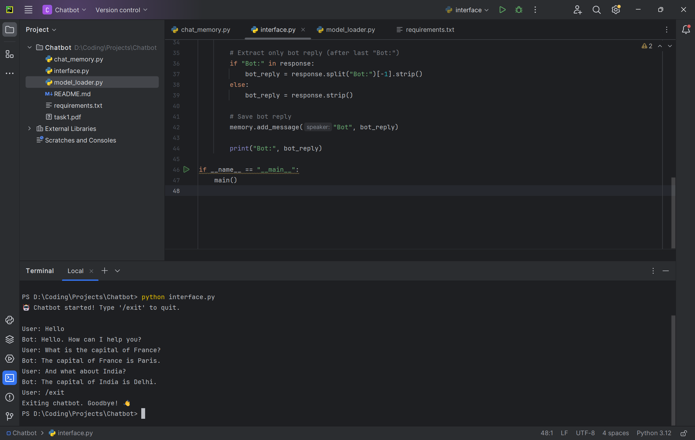

# 📌 Local Command-Line Chatbot (Hugging Face)

## 📖 Overview
This project is a **local command-line chatbot** built using the Hugging Face `transformers` library.  
It uses the **`google/flan-t5-large`** model for factual Q&A and maintains short-term memory of recent exchanges using a **sliding window buffer**.  

The chatbot runs entirely in the terminal, remembers the last few conversation turns, and exits gracefully when the user types `/exit`.

---

## 🎥 Demo Video
[Demo video of the project](https://drive.google.com/file/d/1AwMkGY8fFG8CCzqG1D27X-uG5x7pPZ8V/view?usp=drive_link)

---

## 🛠 Requirements
- Python 3.9+  
- Install dependencies with:

```bash
pip install -r requirements.txt
```

### `requirements.txt`
```txt
transformers>=4.41.1
torch==2.2.2
safetensors>=0.4.2
sentencepiece>=0.1.99
```

---

## 📂 Project Structure
```
chatbot/
│── model_loader.py     # Loads Hugging Face model & tokenizer
│── chat_memory.py      # Implements sliding window conversation memory
│── interface.py        # CLI chatbot loop (integrates model + memory)
│── requirements.txt    # Dependencies
│── README.md           # Documentation
│── screenshot/1.png    # Screenshot of chatbot in action
```

---

## ▶️ How to Run
1. Clone the repository or download the files.
2. Open a terminal in the project folder.
3. (Optional but recommended) Create and activate a virtual environment:
   ```bash
   python -m venv venv
   venv\Scripts\activate   # Windows
   source venv/bin/activate # Mac/Linux
   ```
4. Install dependencies:
   ```bash
   pip install -r requirements.txt
   ```
5. Run the chatbot:
   ```bash
   python interface.py
   ```

---

## 💬 Example Interaction
```
Chatbot started! Type '/exit' to quit.

User: What is the capital of France?
Bot: The capital of France is Paris.

User: And what about India?
Bot: The capital of India is Delhi.

User: /exit
Exiting chatbot. Goodbye!
```

---

## 📸 Screenshot
Here is the chatbot in action:  


